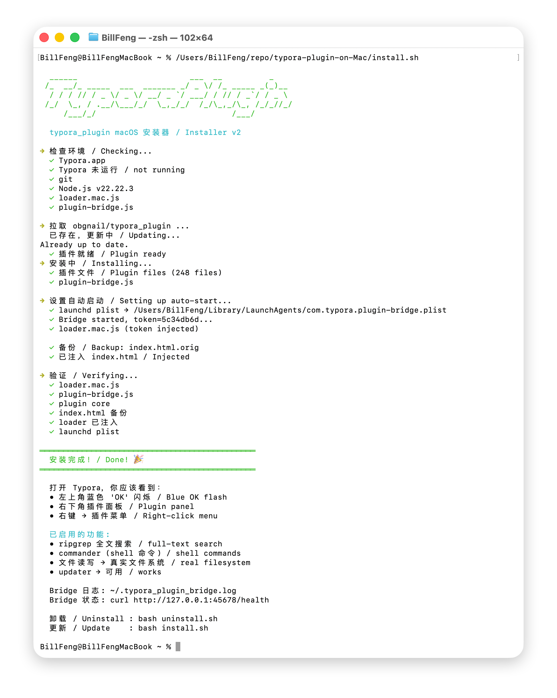
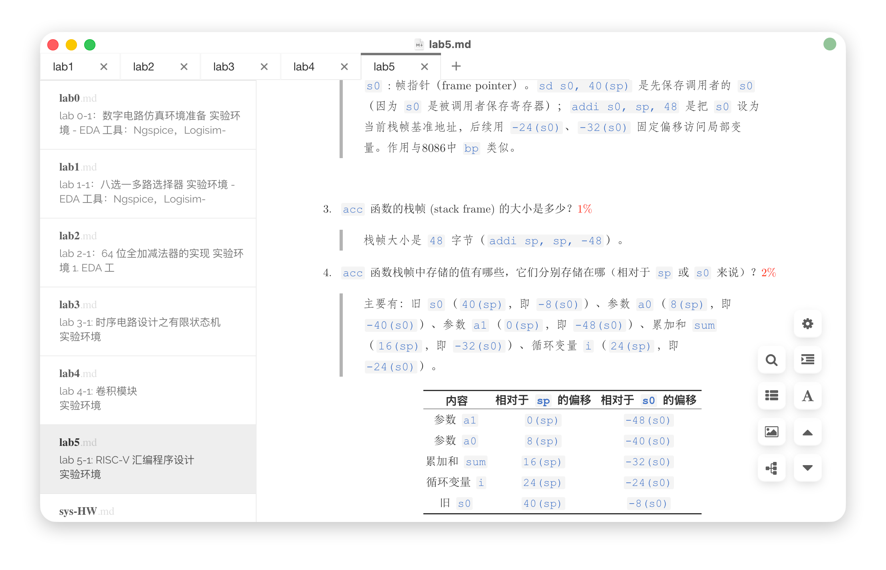

# Typora-plugin-on-Mac

> 在 macOS Typora 上运行 [obgnail/typora_plugin](https://github.com/obgnail/typora_plugin)，一键安装。
>
> 通过本地 Node.js 服务解锁 ripgrep 搜索、shell 命令、真实文件读写等功能。





## 前置要求 / Prerequisites

- macOS Typora
- **Node.js**（必须）— `brew install node` 或 https://nodejs.org
- git

## 安装 / Install

```bash
git clone https://github.com/bfyes/Typora-plugin-on-Mac.git
cd Typora-plugin-on-Mac
bash install.sh
```

重启 Typora 即完成。

## 原理 / How it works

macOS 版 Typora 使用 **WKWebView**（不是 Electron），没有 Node.js 运行时。本项目通过两层提供插件运行环境：

| 组件 | 说明 |
|------|------|
| `loader.mac.js` | WKWebView 内适配器，提供 CommonJS 模块加载 + HTTP 调用 bridge |
| `plugin-bridge.js` | 本地 Node.js HTTP 服务（端口 45678），提供真实 fs/child_process/os/zlib |

```
Typora WKWebView ←→ loader.mac.js ←HTTP→ plugin-bridge.js (Node.js)
```

## 功能 / Features

45 个插件可用，16 个默认禁用（可在设置中启用）：

| 功能 | 快捷键 |
|------|--------|
| 代码块增强（copy/fold/indent） | — |
| commander shell 命令 | Ctrl+Shift+P |
| 文件标签栏 | — |
| 右键菜单 | 右键 |
| markmap 思维导图 | — |
| plantUML / DrawIO / ECharts | — |
| 图片查看器 | — |
| 文字样式、自动编号 | — |
| 暗色模式、只读模式等 | — |

## 已知限制 / Known Issues

- **markdownlint 语法检查**：显示为空，暂不可用（Worker 中的库加载兼容性）
- **ripgrep 文件搜索**：不可用（依赖 `vscode-ripgrep` 模块解析 rg 二进制路径）
- 右键菜单有限

## 脚本 / Scripts

| 脚本 | 用途 |
|------|------|
| `install.sh` | 一键安装/更新 |
| `uninstall.sh` | 卸载（含 bridge/launchd 清理） |

## 卸载 / Uninstall

```bash
bash uninstall.sh
```

## Bridge 运维

```bash
curl http://127.0.0.1:45678/health    # 状态
cat ~/.typora_plugin_bridge.log       # 日志
```

## 许可 / License

MIT — 适配器代码原创。插件归 [obgnail/typora_plugin](https://github.com/obgnail/typora_plugin) 所有。
