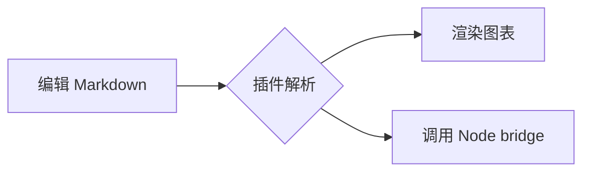
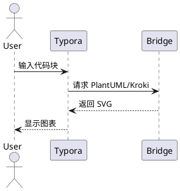
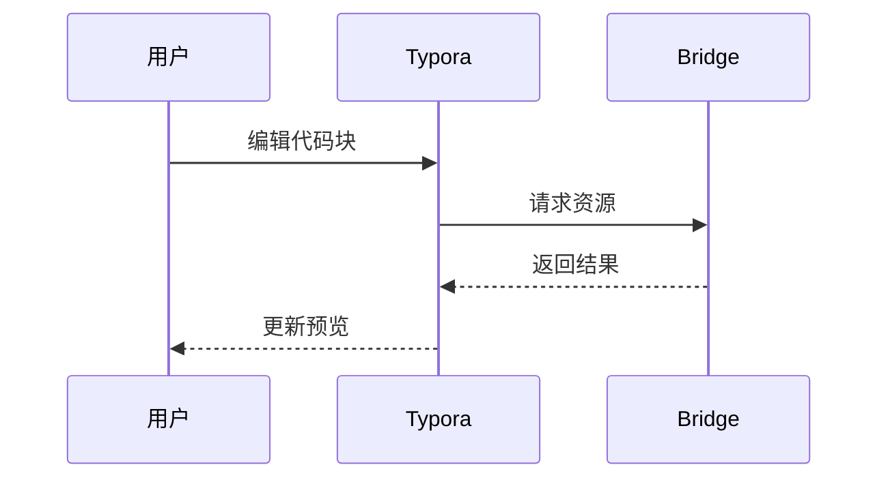
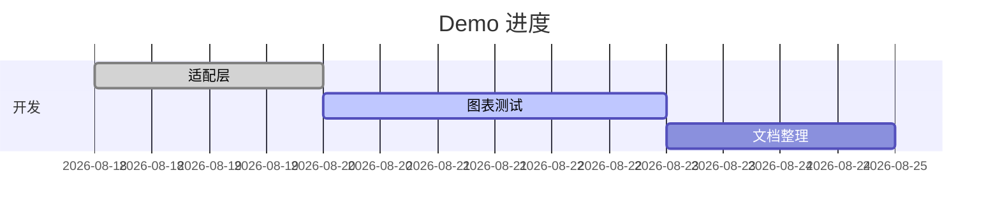
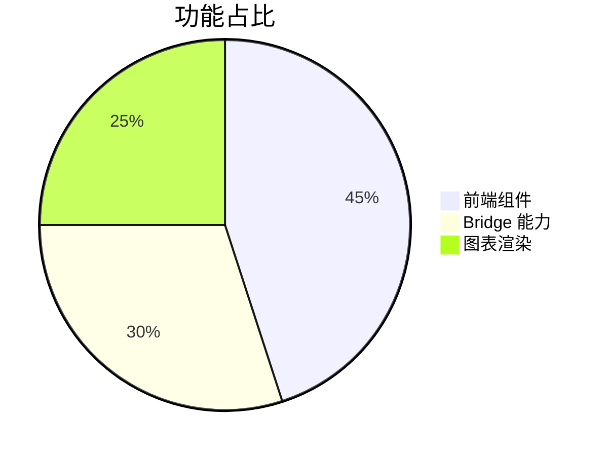
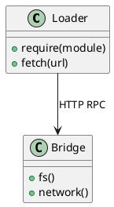

# Typora Plugin macOS Demo

这是一个用于快速检查插件是否正常工作的示例文档。打开后等待图表渲染完成，再逐项点击、编辑或调整大小。

## 编辑增强

- [ ] 任务列表、中文标点配对、自动中英文空格
- **粗体**、*斜体*、~~删除线~~、`行内代码`
- 图片、表格、代码块支持编号和尺寸调整
- 右侧大纲、斜杠命令、命令面板、只读/夜间/无图模式

> [!TIP]
> 这是 Callout 提示框。可以尝试切换主题、调整编辑区宽度，并折叠下面的代码块。

## 表格与代码

| 功能 | 示例 | 预期 |
| --- | --- | --- |
| 表格增强 | 调整列宽、行高 | 可拖动 |
| 自动编号 | 标题、表格、图片、代码 | 自动更新 |
| 语法检查 | markdownlint | 检查错误 |

```javascript
// fence_enhance：复制、折叠和格式化
function hello(name = "Typora") {
  return `Hello, ${name}!`
}
console.log(hello())
```

## Mermaid



## PlantUML（在线渲染）



## ECharts 与 Chart.js

```echarts
option = {
  "title": { "text": "ECharts 示例" },
  "tooltip": {},
  "xAxis": { "data": ["A", "B", "C", "D"] },
  "yAxis": {},
  "series": [{ "type": "bar", "data": [12, 20, 15, 28] }]
}
```

```chart
config = {
  "type": "line",
  "data": {
    "labels": ["一月", "二月", "三月", "四月"],
    "datasets": [{ "label": "访问量", "data": [10, 18, 14, 26] }]
  }
}
```

## 思维导图、看板与时间线

```markmap
# 项目
## 前端
### 编辑器
### 图表
## 后端
### Node bridge
### 文件系统
```

```kanban
# 发布计划
## 待办
- 检查 PlantUML
- 检查原生菜单
## 进行中
- 编写 Demo
## 完成
- Node bridge
```

```timeline
# 项目时间线
## 2026-08-20
- [x] 完成 bridge
- 初始化插件
## 2026-08-21
- [ ] 验证图表
- [ ] 发布 Demo
```

## WaveDrom 与 ABC 乐谱

```wavedrom
{ signal: [
  { name: "clk", wave: "p....." },
  { name: "data", wave: "x.345x", data: "A B C" },
  { name: "req", wave: "0.1..0" }
] }
```

```abc
X:1
T:Demo melody
M:4/4
L:1/4
K:C
C D E F | G2 G2 | c4 |
```

## DrawIO、Marp 与图片

```drawio
{ xml: "<mxGraphModel><root><mxCell id=\"0\"/><mxCell id=\"1\" parent=\"0\"/></root></mxGraphModel>" }
```

```marp
---
marp: true
theme: default
---

# Marp Demo 

这是 Marp 幻灯片代码块。
```


## 后端能力检查清单

- `ripgrep` / `search_multi`：全文搜索当前目录
- `commander`：执行命令（请先确认权限）
- `markdownlint`：打开插件面板检查本文档
- `updater`：检查插件更新
- `preferences`：查看和调整全部插件配置

> PlantUML 依赖网络服务；`ripgrep` 需要安装 `brew install ripgrep`。`right_click_menu` 的作者自定义多级菜单在 macOS 原生菜单桥接下暂不支持。

## 快速验证

1. 修改任意标题，确认大纲和自动编号更新。
2. 修改一个图表数据，确认图表重新渲染。
3. 使用 `Cmd+Shift+P`（若配置启用）打开命令面板。
4. 使用 `Ctrl+右键` 测试圆盘菜单（需在 preferences 启用）。

## 11. 数学公式

行内公式：$E = mc^2$。

块级公式：

$$
\int_{-\infty}^{\infty} e^{-x^2}\,dx = \sqrt{\pi}
$$

$$
\begin{aligned}
f(x) &= x^2 + 2x + 1 \\
     &= (x + 1)^2
\end{aligned}
$$

## 12. 更多 Mermaid 类型







## 13. 更多 PlantUML



## 14. 脚注、链接与引用

这是一个带脚注的句子[^demo]，也是一个[项目链接](https://github.com/obgnail/typora_plugin)。

> 这是引用内容。
>
> 可包含多段文字、列表和代码：
>
> - 第一项
> - 第二项

[^demo]: 脚注由 Typora 原生 Markdown 解析器处理。

## 15. 折叠与 HTML

<details>
<summary>点击展开 HTML 内容</summary>

这里用于测试 HTML 块、内嵌样式和折叠行为。

</details>

<div align="center">
  <kbd>Cmd</kbd> + <kbd>Shift</kbd> + <kbd>P</kbd>
</div>

## 16. 多语言代码高亮

```python
from pathlib import Path

print(Path.cwd())
```

```bash
node --version
curl http://127.0.0.1:45678/health
```

```json
{
  "name": "typora-plugin-on-mac",
  "bridge": true,
  "renderer": ["mermaid", "plantuml", "echarts"]
}
```

```css
.demo-card {
  display: grid;
  gap: 8px;
  border-radius: 8px;
}
```

## 17. 复杂列表与表格

1. 一级步骤
   1. 嵌套步骤 A
   2. 嵌套步骤 B
2. 二级步骤

- [x] 已完成
- [-] 进行中（部分插件支持）
- [ ] 待处理

| 对齐 | 左 | 中 | 右 |
| :--- | :--- | :---: | ---: |
| 数字 | 1 | 2 | 3 |
| 文本 | left | center | right |

---

Demo 结束：如果某个代码块仍显示为源码，请记录它的语言、错误文本和 `~/.typora_plugin_bridge.log` 末尾内容。
